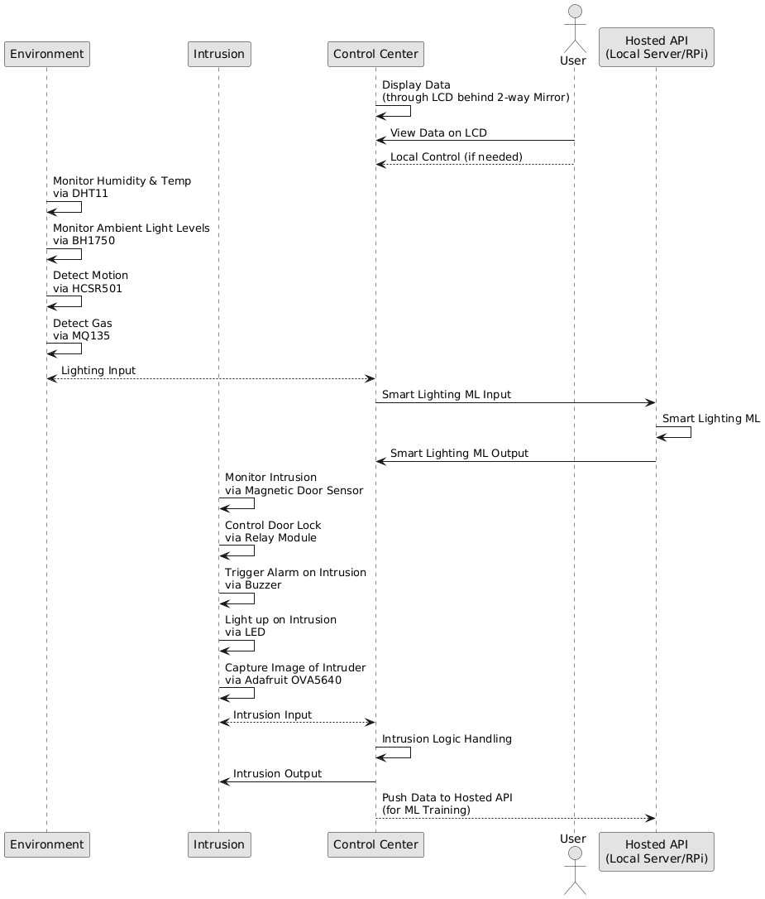

# EE4216-Project
NUS AY2024/25 Sem 1 EE4216 Project


# Git Commands (for team's reference)
Ensure that you're always in your own branch:
```bash
git branch
```
*\* leontan <br>
main* <br>
If you're not in your own branch, do the following:
```bash
git checkout <your-branch-name>
```

## Updating changes from remote branch (usually remote main) to your local branch(es)
All of us will have a local main and local branch of our own. We should always pull and push any commits to the remote branches.

1. Switch to local main branch
```bash
git checkout main
```
2. Pull all changes from remote main to local main branch
```bash
git pull origin main
```
3. Switch to your working branch
```bash
git checkout <your-branch-name>
```
4. Merge the latest changes from local main (pulled from remote main) to your working branch
```bash
git merge main
```

## Pushing latest changes to remote main branch
This happens when we are confirmed with certain changes/updates/features that we would like to see in our project. This is also the main folder that we are working on for "submission". <br>
<br> If you have understood the explanations so far, you can tell that pushing commits to your local branch is actually "useless" since it does not reach to remote branch for sharing. <br>
However, pushing commits in local branch is useful if you happen to require any form of reverting due to deleted files etc. (basically an undo button)
1. Add changes to **Staging Area** ("." means all new changes, you may specify any specific files to stage and replace the ".".)
```bash
git add .
```
2. Commit the changes (write a commit message to describe the changes that you will be pushing)
```bash
git commit -m "Push RTOS codebase."
```
3. (Optional to update your remote working branch) Push your changes from local working branch to remote working branch
```bash
git push origin <your-branch-name>
```
4. Switch to local main branch
```bash
git checkout main
```
5. Update the local main branch before pushing changes (in case one of us made an update first, **otherwise handling conflicts will be a mess later**)
```bash
git pull origin main
```
6. Merge changes from local working branch to local main branch
```bash
git merge <your-branch-name>
```
7. Push the updated local main branch to remote main branch
```bash
git push origin main
```